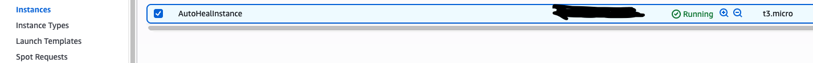

# Auto-Healing Infrastructure on AWS

## Project Overview
This project automates **EC2 instance healing** using **AWS CloudWatch, SNS, and Lambda**.  
When an EC2 instance becomes unresponsive or has **low CPU utilization**, an automated process **detects** the issue and **reboots** the instance without manual intervention.  

This ensures **high availability** and **reduced downtime** for workloads running on AWS.

---

## Architecture

**Flow:**
1. An EC2 instance runs continuously in AWS.
2. CloudWatch monitors its CPU utilization metrics.
3. When CPU drops below a threshold (e.g., < 10%), a **CloudWatch alarm** is triggered.
4. The alarm publishes a message to an **SNS topic**.
5. The **SNS topic** invokes a **Lambda function**.
6. The **Lambda function** automatically **reboots** the EC2 instance to restore service.
7. The reboot action and logs are captured in **CloudWatch Logs** for monitoring.

---

## Screenshots

### 1. SNS Topics
SNS setup used to send notifications and trigger the Lambda function.

---

### 2. Lambda Function
Lambda function that automatically reboots the instance when triggered.

---

### 3. CloudWatch Alarm
CloudWatch alarm that detects low CPU utilization and triggers SNS + Lambda.

---

### 4. Instance Stopped (Before Auto-Heal)
When CPU utilization drops, the CloudWatch alarm triggers the instance enters the stopped state.

---

### 5. Instance Running (After Auto-Heal)
The Lambda function automatically reboots the EC2 instance.

---

## How It Works  

1. **Terraform** provisions all AWS resources:
   - EC2 Instance  
   - CloudWatch Alarm  
   - SNS Topics  
   - Lambda Function (with IAM role and permissions)

2. **CloudWatch** monitors CPU utilization in real-time.

3. If CPU utilization falls below **10% for 5 minutes** (or your defined threshold),  
   CloudWatch triggers the **SNS topic** and sends an alert email.

4. The **SNS topic** invokes the **Lambda function**

5. Lambda uses IAM role with AmazonEC2FullAccess and AWSLambdaBasicExecutionRole to safely reboot the instance.

6. Logs can be monitored in CloudWatch Logs under the Lambda log group.
